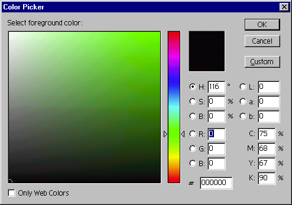

## ColorPicker7

### Description

ColorPicker Adobe PhotoShop Style. A fully functioning Beta version. Updated the html-help file but I can't manage to make the browser boot yet. Stay tuned.
 
### More Info
 
RGB values.

             |
---                |---
**Submitted On**   |2003-04-20 03:45:08
**By**             |[AnnaCarin](https://github.com/Planet-Source-Code/PSCIndex/blob/master/ByAuthor/annacarin.md)
**Level**          |Intermediate
**User Rating**    |5.0 (10 globes from 2 users)
**Compatibility**  |VB 6\.0
**Category**       |[Graphics](https://github.com/Planet-Source-Code/PSCIndex/blob/master/ByCategory/graphics__1-46.md)
**World**          |[Visual Basic](https://github.com/Planet-Source-Code/PSCIndex/blob/master/ByWorld/visual-basic.md)
**Archive File**   |[ColorPicke2055913242007\.zip](https://github.com/Planet-Source-Code/annacarin-colorpicker7__1-68190/archive/master.zip)

